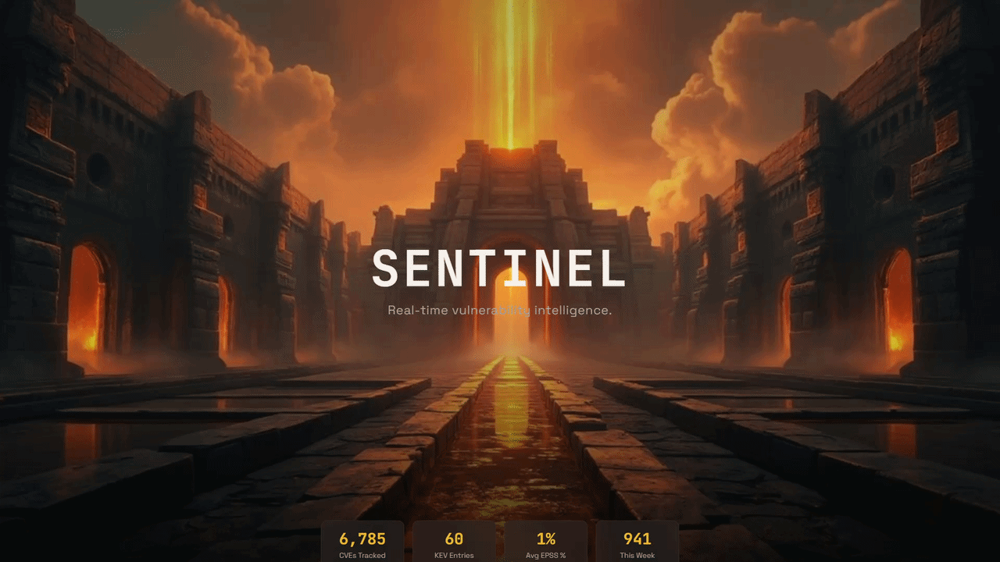

# Sentinel

**Live:** [sentinel.nfroze.co.uk](https://sentinel.nfroze.co.uk)

A real-time vulnerability intelligence dashboard that fuses NVD, CISA KEV, and EPSS data into a single composite risk score - surfacing the CVEs most likely to be exploited, not just the ones with the highest CVSS.

## Overview

Nearly 50,000 CVEs were published in 2025, but only around 0.5% are confirmed exploited in the wild. Most teams still triage by CVSS score alone, which measures theoretical attack complexity rather than real-world exploitation likelihood. The result is alert fatigue: critical-rated CVEs that nobody will ever weaponise buried alongside medium-rated ones already being used in active campaigns.

Sentinel solves this by fusing three federal vulnerability data sources - NVD for CVE metadata and CVSS scores, CISA's Known Exploited Vulnerabilities catalogue for confirmed exploitation, and FIRST's EPSS for statistical exploitation probability - into a single composite risk score. The formula weights EPSS higher than CVSS (40% vs 35%) and adds a flat 25-point bonus for any CVE on the CISA KEV list. This means a CVSS 7.2 vulnerability that's actively exploited scores higher than a CVSS 9.8 that nobody's using - which is exactly how professional threat intelligence teams actually prioritise.

The dashboard surfaces the top 10 most critical recent vulnerabilities, provides a filterable threat feed with search, and tracks monthly KEV addition trends. Sentinel runs on serverless infrastructure for roughly £3/month.

## Architecture

An ingestion Lambda runs every six hours via EventBridge, pulling modified CVEs from the NVD API (paginated at 2,000 per request with 6.5-second delays between pages for rate-limit compliance), cross-referencing against the full CISA KEV catalogue, and batch-fetching EPSS scores (100 CVEs per request). Each CVE is scored, enriched with vendor/product data extracted from CPE criteria, and written to DynamoDB.

The single-table DynamoDB design uses `STATUS#ACTIVE` as the GSI partition key, enabling three access patterns through separate Global Secondary Indexes: CompositeScoreIndex for risk-ranked queries, PublishedDateIndex for recency queries, and VendorIndex for vendor filtering. Pre-computed stats and trends are written as special records at ingest time, so the API Lambda never needs to run expensive aggregation scans.

The API Lambda has read-only DynamoDB permissions - a deliberate least-privilege separation from the ingestion Lambda's write access. If the API is compromised, the attacker cannot corrupt data. The frontend is a React 19 SPA with Recharts for trend visualisation and base64-encoded cursor pagination for DynamoDB's LastEvaluatedKey.

## Tech Stack

**Frontend**: React 19, TypeScript, Vite 7, Tailwind CSS 3, Recharts 3, React Icons

**Backend**: AWS Lambda (Python 3.12) - ingestion (256 MB, 5 min timeout) + API (128 MB, 30s timeout)

**Data**: DynamoDB (on-demand, single-table with 3 GSIs), EventBridge (6-hour schedule)

**Infrastructure**: API Gateway HTTP API, S3 (static hosting), Cloudflare (DNS, SSL), Terraform, eu-west-2

**Data Sources**: NVD CVE 2.0 API, CISA KEV JSON feed, FIRST EPSS API

## Key Decisions

- **EPSS weighted higher than CVSS (40% vs 35%)**: CVSS measures theoretical attack complexity; EPSS measures observed exploitation probability. A medium-severity vulnerability actively exploited in the wild is a bigger problem than a critical one that isn't. The weighting reflects how professional threat intel teams actually prioritise.

- **Separate least-privilege IAM roles**: The ingestion Lambda gets read-write access (PutItem, BatchWriteItem, UpdateItem, GetItem, Query, Scan) because it needs to scan the table for pre-computed stats and trends. The API Lambda gets read-only access (GetItem, Query, Scan). If the API is compromised, the attacker cannot corrupt data.

- **Pre-computed stats at ingest time**: Dashboard statistics and monthly trends are written as special DynamoDB records during ingestion rather than aggregated on API request. This eliminates expensive Scan operations on the hot path and keeps dashboard loads sub-100ms.

- **HTTP API over REST API**: AWS HTTP API is roughly 50% cheaper and lower latency than REST API. For GET-only operations with CORS, REST API's additional features (WAF integration, usage plans) aren't needed.

## Author

**Noah Frost**

- Website: [noahfrost.co.uk](https://noahfrost.co.uk)
- GitHub: [github.com/nfroze](https://github.com/nfroze)
- LinkedIn: [linkedin.com/in/nfroze](https://linkedin.com/in/nfroze)
